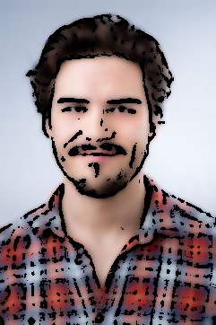

# Effex - Image Filter Application 🎨

### Live Demo
**🌐 [Try it live: https://rg-effex.streamlit.app/](https://rg-effex.streamlit.app/)**

<div align="center">
  <table>
    <tr>
      <td align="center">
        <strong>Original Image</strong><br/>
        
      </td>
      <td align="center">
        <strong>Watercolor Effect</strong><br/>
        
      </td>
    </tr>
    <tr>
      <td align="center">
        <strong>Pencil Sketch</strong><br/>
        
      </td>
      <td align="center">
        <strong>Cartoon Effect</strong><br/>
        
      </td>
    </tr>
    <tr>
      <td align="center">
        <strong>Sepia Effect</strong><br/>
        
      </td>
      <td align="center">
        <strong>HDR Effect</strong><br/>
        
      </td>
    </tr>
  </table>
</div>

---

### Description
This is a **Streamlit-based web application** that allows users to apply artistic filters to their images. Users can upload an image and apply effects like watercolor sketch, pencil sketch, cartoon, sepia, HDR, and sharpen effects. The application supports dark and light modes for better user experience.

---

### Features
- **Artistic Filters**:
  - **Watercolor Sketch** 🖌️
  - **Pencil Sketch** ✏️
  - **Cartoon Effect** 🎨
  - **Sepia Effect** 📜
  - **HDR Effect** 🌄
  - **Sharpen Effect** 🔍
- **Dark Mode and Light Mode** toggle for customizable appearance.
- **Real-time Filter Preview** of all effects.
- **Download Processed Images** with a single click.
- Feedback submission for user input.

---

### Installation

1. Clone this repository:
   ```bash
   git clone https://github.com/rgsuhas/Image-Filter-Application
   cd Image-Filter-Application
   ```

2. Install the required dependencies:
   ```bash
   pip install -r requirements.txt
   ```

3. Run the application:
   ```bash
   streamlit run main_app.py
   ```

---

### Usage

1. **Upload an Image**:
   - Use the "Upload Your Image" section to select an image (`PNG`, `JPG`, or `JPEG` format).

2. **Choose a Filter**:
   - Select one of the filters from the available options.

3. **View Previews**:
   - View real-time previews of all filters in the "Filter Previews" section.

4. **Process and Download**:
   - The selected filter is applied, and the result is displayed alongside the original image.
   - Use the "Download Processed Image" button to save the edited image.

---

### Filters Description

1. **Watercolor Sketch** 🖌️:
   - Creates a vibrant watercolor effect with enhanced edges.

2. **Pencil Sketch** ✏️:
   - Converts the image into a grayscale pencil sketch.

3. **Cartoon Effect** 🎨:
   - Applies a cartoon-like effect with bold colors and edges.

4. **Sepia Effect** 📜:
   - Gives the image a vintage, warm sepia tone.

5. **HDR Effect** 🌄:
   - Enhances image contrast and texture for a high dynamic range effect.

6. **Sharpen Effect** 🔍:
   - Sharpens image details by enhancing edges.

---

### File Structure

```plaintext
📁 Effex
├── main_app.py              # Main Streamlit application
├── requirements.txt          # Python dependencies
├── styles.css               # Custom CSS styling
├── .streamlit/config.toml   # Streamlit configuration
├── Procfile                 # Heroku deployment config
├── sample_img/              # Sample images for testing
├── processed/               # Processed image examples
└── README.md               # Documentation
```

---

### Dependencies

- **Streamlit**: For the web interface.
- **OpenCV**: For image processing.
- **Pillow**: For image file handling.
- **NumPy**: For numerical operations.

Install dependencies with:
```bash
pip install -r requirements.txt
```

---

### Deployment

This application is deployed on **Streamlit Cloud** and can be accessed at:
**🌐 [https://rg-effex.streamlit.app/](https://rg-effex.streamlit.app/)**

For local deployment:
```bash
streamlit run main_app.py --server.headless true
```

---

### Feedback

If you have suggestions or encounter issues, feel free to submit feedback through the application or open an issue on the repository.

Enjoy creating beautiful artistic images! 🎨
